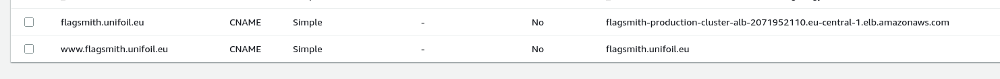
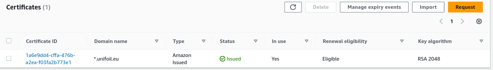
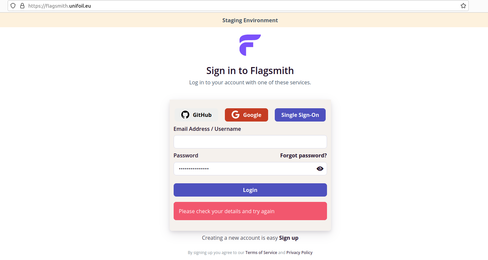

# Flagsmith AWS Starter kit

## Deploying Flagsmith to AWS ECS (with whitenoise)

AWS infrastructure consists of:
- IAM
- Route53 subdomain
- Networking:
    - VPC
    - Public and private subnets
    - Routing tables
    - Internet Gateway
- Security Groups
- Load Balancers, Listeners, and Target Groups
- IAM Roles and Policies
- ECS:
    - Task Definition with flagsmith:latest image
    - Cluster
    - Service
- RDS
- Secrets with Parameter Store
- Logs

## How to use this project

1. Register AWS Route53 Hosted Zone \
  for example ```yourdomain.com```

2. Generate certificate with AWS Certificate Manager \
  with ```*.yourdomain.com``` pattern

3. Define your variables such as certificate arn, hosted zone domain, and other desired settings in **terraform.tfvars** file 
    ```bash
    route53_hosted_zone = "yourdomain.com"
    certificate_arn = "arn:aws:acm:"
    ```

    Currently containers are run on Fargate SPOT instances:
    ecs_service.tf:
    ```bash
    capacity_provider_strategy {
    capacity_provider = "FARGATE_SPOT"
    weight            = 100
    }
    capacity_provider_strategy {
      capacity_provider = "FARGATE"
      weight            = 0
    }
    ```
4. Generate plan for infrastructure ```terraform plan -out flagsmith.tfplan```
5. Apply infrastructure by running ```terraform apply flagsmith.tfplan```

After a few minutes flagsmith will be available at your domain




you can delete a whole setup by running ```terraform destroy --auto-approve```
